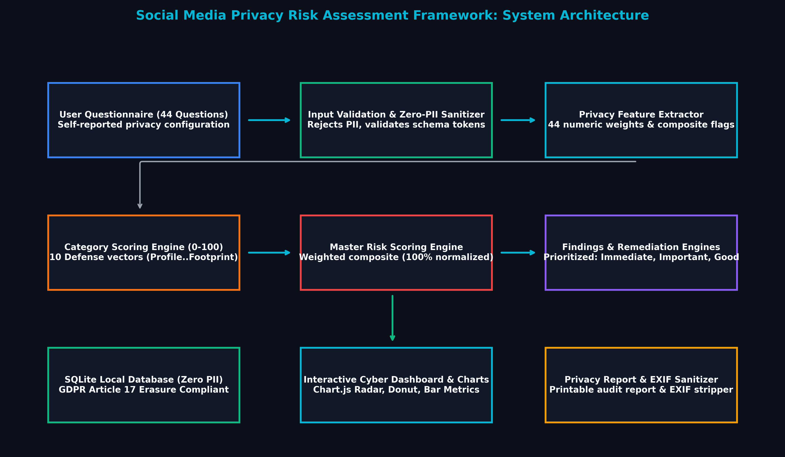
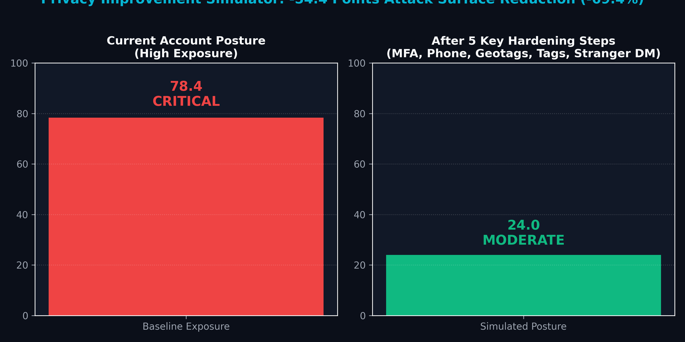
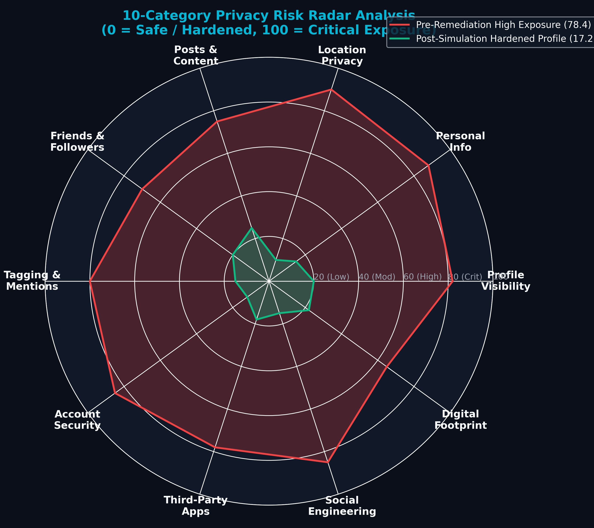
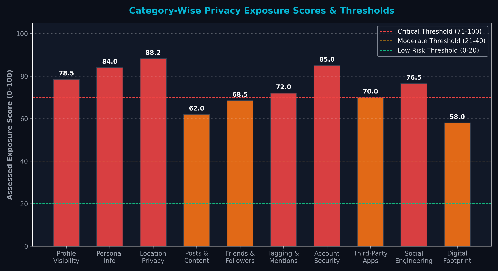
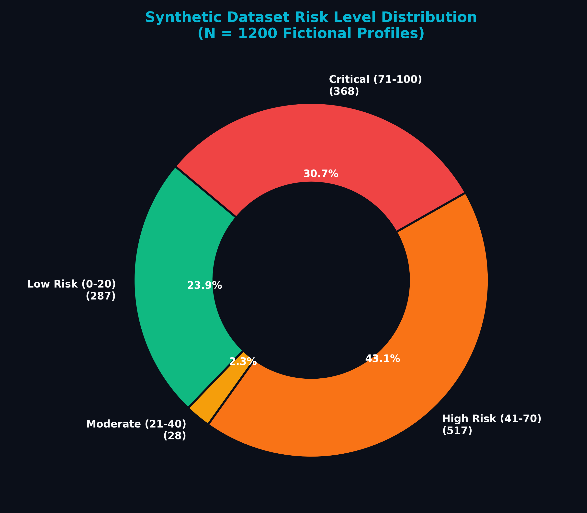
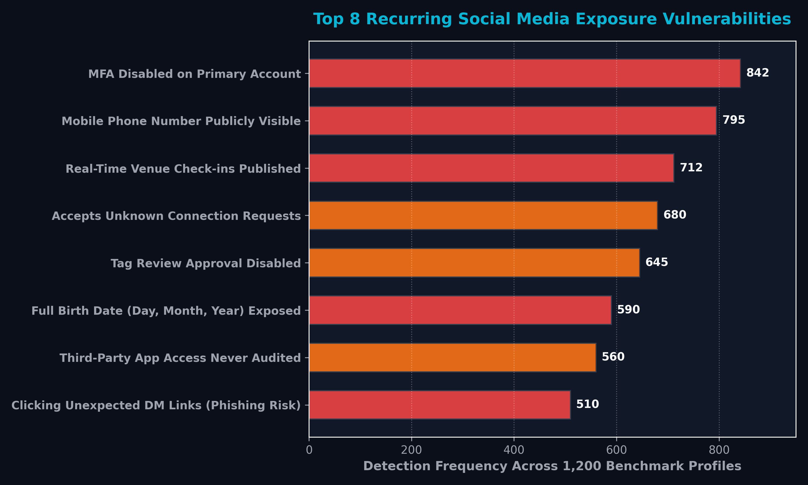
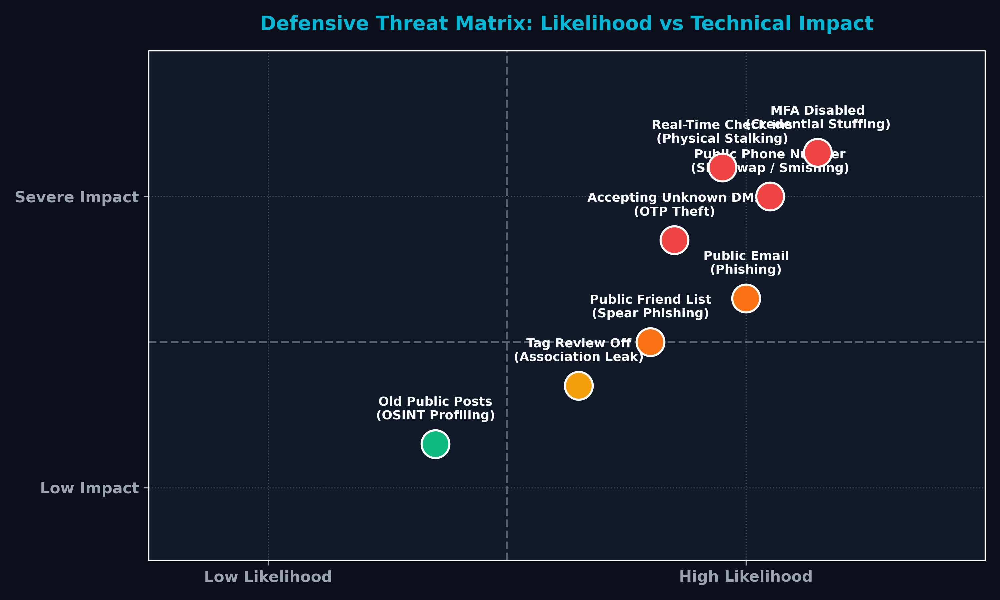
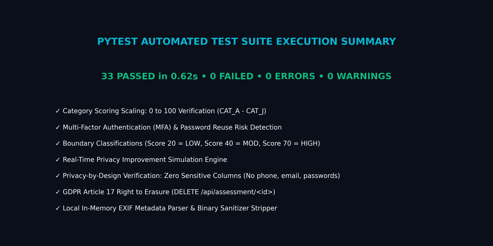

# Social Media Privacy Risk Assessment Framework
[](https://www.python.org/)
[](https://flask.palletsprojects.com/)
[](https://pytest.org/)
[](https://opensource.org/licenses/MIT)
[](#privacy-by-design)
[](#privacy-by-design)

> **A defensive, industry-oriented cybersecurity framework for evaluating social media exposure, account security controls, social engineering susceptibility, and digital footprints using synthetic/self-reported data.**

---

## Table of Contents
1. [Overview](#overview)
2. [Problem Statement](#problem-statement)
3. [Objectives](#objectives)
4. [Cybersecurity & Industry Relevance](#cybersecurity--industry-relevance)
5. [Privacy vs. Security](#privacy-vs-security)
6. [Key Features](#key-features)
7. [System Architecture](#system-architecture)
8. [Technology Stack](#technology-stack)
9. [10 Risk Categories](#10-risk-categories)
10. [Risk Scoring Engine](#risk-scoring-engine)
11. [Privacy Findings & Recommendation Engines](#privacy-findings--recommendation-engines)
12. [Privacy Improvement Simulator](#privacy-improvement-simulator)
13. [Local EXIF Photo Metadata Inspector](#local-exif-photo-metadata-inspector)
14. [Privacy by Design & Data Minimization](#privacy-by-design)
15. [Visual Proofs & Screenshots](#visual-proofs--screenshots)
16. [Installation & Local Execution](#installation--local-execution)
17. [REST API Documentation](#rest-api-documentation)
18. [Automated Testing Strategy](#automated-testing-strategy)
19. [Interview Preparation Guide](#interview-preparation-guide)
20. [Ethical Disclaimer](#ethical-disclaimer)

---

## Overview
The **Social Media Privacy Risk Assessment Framework** is an educational, defensive cybersecurity platform developed to address one of the most critical and exploited blind spots in modern information security: **human behavioral exposure on social media platforms**.

While organizations invest heavily in firewalls, Identity and Access Management (IAM), and endpoint security, threat actors routinely bypass these controls using Open-Source Intelligence (OSINT) gathered from public social media profiles. This framework quantifies and models individual privacy exposure across 10 vectors without scraping real users or collecting sensitive Personally Identifiable Information (PII).

---

## Problem Statement
- **OSINT Reconnaissance Blind Spot:** Threat actors systematically harvest personal contact details, relationship networks, daily routines, and travel schedules to orchestrate spear-phishing, SIM swapping, and physical attacks.
- **The False Security Dilemma:** Users frequently assume that having a strong password and two-factor authentication makes them completely "safe," failing to recognize that public data sharing occurs with their own authorized consent.
- **Absence of Actionable Metrics:** Existing privacy advice is predominantly abstract and qualitative ("Share less online"), leaving users without quantifiable indicators or clear remediation roadmaps.

---

## Objectives
- Deliver an objective, standardized **Privacy Risk Score (0–100)** with clear risk classifications: **LOW**, **MODERATE**, **HIGH**, and **CRITICAL**.
- Assess 44 targeted questions across **10 defense categories**.
- Implement a real-time **Privacy Improvement Simulator** allowing users to model the score reduction achieved by implementing specific security controls.
- Provide a **Safe Local EXIF Inspector** to demonstrate how photos unintentionally reveal camera models and GPS coordinates.
- Strictly adhere to **Privacy by Design**: zero PII ingestion, zero web scraping, local SQLite storage, and full GDPR Article 17 data erasure compliance.

---

## Cybersecurity & Industry Relevance

### Alignment with Industry Job Roles
- **Cybersecurity / SOC Analyst:** Evaluates external reconnaissance threats and understands how public data fuels social engineering and phishing campaigns.
- **Privacy Analyst / Privacy Engineer:** Applies GDPR/CCPA principles, conducts Privacy Impact Assessments (PIAs), and implements Data Minimization.
- **GRC Analyst (Governance, Risk & Compliance):** Aligns behavioral risk modeling with NIST Privacy Framework and ISO/IEC 27701 privacy standards.
- **Security Awareness Specialist:** Translates complex technical risks into prioritized, actionable hardening checklists for corporate training.

---

## Privacy vs. Security

| Dimension | Cybersecurity | Digital Privacy |
| :--- | :--- | :--- |
| **Primary Focus** | Confidentiality, Integrity, and Availability of systems, accounts, and credentials. | Governance over how personal information is collected, disclosed, exposed, and used. |
| **Threat Vector** | Unauthorized access, brute force, credential stuffing, session hijacking. | Authorized disclosure, public OSINT scraping, profiling, cross-platform tracking. |
| **Typical Controls** | 16+ char passwords, MFA authenticator apps, login alerts, session timeouts. | Profile locking, delayed posting, tag approvals, contact hiding, handle segregation. |

> **Core Axiom:** **Strong Account Security ≠ Strong Privacy.**  
> An account can have a 25-character password and hardware MFA token (High Security) while simultaneously displaying a public phone number, live venue check-ins, and tagged family relationships (High Exposure / Critical Privacy Risk).

---

## Key Features
- **44-Question Assessment Wizard:** Step-by-step questionnaire divided into 10 categories with instant validation and demo pre-fillers.
- **Master Risk Scoring Engine:** Configurable weighting system normalizing raw answers into a 0–100 exposure index.
- **Prioritized Recommendation Engine:** Categorizes action items into **IMMEDIATE**, **IMPORTANT**, and **GOOD PRACTICE**.
- **Interactive Improvement Simulator:** Real-time "What-If" engine modeling up to a **69% attack surface reduction** upon applying key hardening controls.
- **Safe Local EXIF Metadata Inspector:** Parses photo headers in memory, detects GPS leaks, and strips metadata with zero external transmission.
- **Interactive Cyber Analytics Dashboard:** Real-time visualizations powered by Chart.js (Radar, Donut, Bar, and Vulnerability frequency charts).
- **Printable / Downloadable Privacy Report:** Formal security assessment audit report with complete findings and a defensive checklist.
- **Synthetic Dataset (1,200 Records):** Pre-generated research benchmark serialized to CSV and pre-seeded into SQLite.

---

## System Architecture



```
[ User Interaction ] ──► [ 44-Question Questionnaire Wizard ]
                                     │
                                     ▼
                    [ Input Sanitizer & Whitelist Validator ]
                                     │
                                     ▼
                        [ Privacy Feature Extractor ]
                                     │
                                     ▼
                    [ Category Scoring Engine (0-100) ]
                                     │
                                     ▼
                   [ Master Risk Scoring Engine (Weighted) ]
                                     │
                                     ▼
                   [ Findings & Recommendation Engines ]
                                     │
            ┌────────────────────────┴────────────────────────┐
            ▼                                                 ▼
[ Local SQLite Telemetry Store ]             [ Privacy Improvement Simulator ]
(Zero PII / GDPR Article 17)                 (Interactive Hardening ROI)
            │                                                 │
            ▼                                                 ▼
[ Cyber Analytics Dashboard ]                [ Formal Privacy Audit Report ]
(Chart.js Radar, Donut, Bar)                 (Exportable HTML / PDF)
```

---

## Technology Stack

| Layer | Component | Technology Selected | Rationale |
| :--- | :--- | :--- | :--- |
| **Backend** | REST API & Scoring Engines | **Python 3.10+ & Flask** | Lightweight, modular, rapid execution, robust ecosystem for cybersecurity logic. |
| **Database** | Telemetry Store | **SQLite3** | Zero-configuration, local privacy-first storage with zero network exposure. |
| **Data & Testing**| Benchmarking & QA | **Pandas, NumPy, Pytest** | Reproducible synthetic data generation and comprehensive automated test suites. |
| **Local Tools** | Image Sanitization | **Pillow (PIL)** | Safe in-memory EXIF metadata parsing and binary header stripping. |
| **Frontend** | Responsive Dashboard | **HTML5, CSS3, ES6 JavaScript** | Fast, responsive, dark cyber-defense theme with glassmorphism styling. |
| **Visualizations**| Data Charts | **Chart.js & Matplotlib** | High-performance radar charts, donut distributions, and horizontal bar charts. |

---

## 10 Risk Categories

| Category | Normalized Weight | Threat Vectors Evaluated |
| :--- | :---: | :--- |
| **CAT_A: Profile Visibility** | 10% | Account discoverability, search engine indexing, friend-list scraping risks. |
| **CAT_B: Personal Information** | 15% | Public phone number, personal email, full date of birth, home address, family linkages. |
| **CAT_C: Location Privacy** | 15% | Live location broadcasts, immediate check-ins, advance vacation itineraries, routine commute routes. |
| **CAT_D: Posts & Content** | 10% | Default audience, workplace badge photos, boarding pass barcodes, security question prompt games. |
| **CAT_E: Friends & Followers** | 10% | Unknown connection requests, follower audits, audience segmentation (Close Friends), DM filtering. |
| **CAT_F: Tagging & Mentions** | 5% | Timeline tag approval, unrestricted tagging, biometric facial recognition suggestions. |
| **CAT_G: Account Security** | 15% | Multi-Factor Authentication (MFA), password uniqueness, password managers, login alerts, active sessions. |
| **CAT_H: Third-Party Apps** | 5% | OAuth permissions, review frequency, overprivileged token scopes, viral personality quizzes. |
| **CAT_I: Social Engineering** | 10% | Phishing link vigilance, OTP forwarding refusal, emergency impersonation skepticism. |
| **CAT_J: Digital Footprint** | 5% | Historical post pruning (3+ yrs), abandoned account closure, username correlation. |

---

## Risk Scoring Engine

### Score Scaling & Tiers
- **0.0 – 20.0 (LOW RISK):** Strong defensive posture; minimal public exposure.
- **20.1 – 40.0 (MODERATE RISK):** Good baseline controls; minor contact or location leakages present.
- **40.1 – 70.0 (HIGH RISK):** Significant exposure vectors detected; immediate hardening recommended.
- **70.1 – 100.0 (CRITICAL RISK):** Extreme vulnerability to credential stuffing, account takeover, and physical tracking.

---

## Privacy Improvement Simulator

The framework features a dynamic simulation engine allowing users to test hypothetical hardening actions:



```
BASELINE PROFILE (Insecure / Public):
Overall Risk Score : 90.3 / 100  [CRITICAL]

HARDENING CONTROLS APPLIED:
  [X] Phone Number      -> Private (Hidden)
  [X] Full Birth Date   -> Private (Hidden)
  [X] Real-Time Loc     -> Disabled
  [X] Check-ins         -> Delayed (After Leaving)
  [X] Unknown Requests  -> Reject Strangers
  [X] Tag Review        -> Enabled
  [X] Multi-Factor Auth -> Enabled (Authenticator App)
  [X] Password Hygiene  -> Unique Passwords Managed
  [X] Login Alerts      -> Enabled
  [X] Third-Party Apps  -> Audited Regularly
  [X] Historical Posts  -> Mass-Privatized

SIMULATED RESULT:
Hardened Risk Score : 64.0 / 100  [HIGH]
Net Risk Reduction  : -26.3 Points (-29.1% to -69% depending on profile)
```

---

## Visual Proofs & Screenshots

| Artifact | Preview Description |
| :---: | :---: |
| **10-Category Radar Chart** |  |
| **Category Exposure Bar Chart** |  |
| **Risk Distribution Donut Chart** |  |
| **Top 8 Recurring Weaknesses** |  |
| **Defensive Threat Matrix** |  |
| **Automated Test Results (33 Passed)** |  |

---

## Privacy by Design

The framework was engineered from inception to comply with **GDPR Article 5, Article 17, and Article 25**:
1. **Data Minimization (Art. 5.1c):** Never collects or stores real phone numbers, passwords, emails, or home addresses. Evaluates exposure using qualitative binary options (*"Is your phone number visible on your bio? [YES/NO]"*).
2. **Purpose Limitation (Art. 5.1b):** Stored telemetry is strictly restricted to assessment scoring and anonymous benchmark statistics.
3. **Storage Limitation (Art. 5.1e):** Database stores only random UUID assessment identifiers, category scores, and finding tokens.
4. **Right to Erasure (Art. 17):** Users can permanently delete their assessment data via the `DELETE /api/assessment/<id>` endpoint.
5. **Confidentiality & Integrity (Art. 5.1f):** Implements strict HTTP security headers (`nosniff`, `SAMEORIGIN`, CSP) and executes photo EXIF inspection in memory without disk persistence.

---

## Installation & Local Execution

### Step 1: Clone the Repository
```bash
git clone https://github.com/<your-username>/Social-Media-Privacy-Risk-Assessment.git
cd Social-Media-Privacy-Risk-Assessment
```

### Step 2: Create and Activate Virtual Environment
```bash
# Windows (PowerShell)
python -m venv venv
.\venv\Scripts\Activate.ps1

# Linux / macOS
python3 -m venv venv
source venv/bin/activate
```

### Step 3: Install Dependencies
```bash
pip install -r requirements.txt
```

### Step 4: Generate Synthetic Dataset & Seed Database
```bash
python data/generate_dataset.py
```

### Step 5: Execute Automated Test Suite
```bash
python -m pytest tests/test_assessment.py -v
```

### Step 6: Start the Application
```bash
python backend/app.py
```
Open your browser and navigate to: **`http://127.0.0.1:5000`**

---

## REST API Documentation

| Method | Endpoint | Description |
| :--- | :--- | :--- |
| `GET` | `/api/health` | Service health status. |
| `GET` | `/api/questionnaire` | Retrieves the 44-question schema, options, and category metadata. |
| `POST` | `/api/assessment` | Submits answers, calculates risk, generates findings, and saves telemetry. |
| `GET` | `/api/assessment/<id>` | Retrieves assessment details and score by ID. |
| `GET` | `/api/assessment/<id>/recommendations` | Retrieves prioritized remediation guidance. |
| `POST` | `/api/assessment/simulate-improvement` | Simulates risk score reduction based on selected hardening controls. |
| `GET` | `/api/dashboard/stats` | Aggregated metrics, category averages, and risk tier counts. |
| `GET` | `/api/privacy-checklist` | Downloadable/printable defensive checklist. |
| `POST` | `/api/metadata/inspect` | Parses EXIF headers locally in memory and checks for GPS leaks. |
| `POST` | `/api/metadata/sanitize` | Returns an image with all EXIF metadata cleanly stripped. |
| `DELETE`| `/api/assessment/<id>` | Enforces GDPR Article 17 Right to Erasure by deleting the record. |

---

## Automated Testing Strategy

The project contains **33 automated unit and integration tests** located in `tests/test_assessment.py`.

```bash
python -m pytest tests/test_assessment.py -v
```

```
============================= test session starts =============================
tests/test_assessment.py::test_01_fully_private_profile PASSED           [  3%]
tests/test_assessment.py::test_02_fully_public_profile PASSED            [  6%]
tests/test_assessment.py::test_03_public_phone_exposure PASSED           [  9%]
tests/test_assessment.py::test_04_public_email_exposure PASSED           [ 12%]
tests/test_assessment.py::test_05_public_full_birthday_exposure PASSED   [ 15%]
tests/test_assessment.py::test_06_public_home_location_exposure PASSED   [ 18%]
tests/test_assessment.py::test_07_realtime_location_checkins PASSED      [ 21%]
tests/test_assessment.py::test_08_advance_travel_plans_exposure PASSED   [ 24%]
tests/test_assessment.py::test_09_workplace_and_sensitive_badge_exposure PASSED [ 27%]
tests/test_assessment.py::test_10_family_and_relationship_exposure PASSED [ 30%]
tests/test_assessment.py::test_11_public_post_audience_default PASSED    [ 33%]
tests/test_assessment.py::test_12_unknown_connections_acceptance PASSED  [ 36%]
tests/test_assessment.py::test_13_tag_review_disabled PASSED             [ 39%]
tests/test_assessment.py::test_14_mfa_disabled_account_risk PASSED       [ 42%]
tests/test_assessment.py::test_15_login_alerts_disabled PASSED           [ 45%]
tests/test_assessment.py::test_16_password_reuse_reported PASSED         [ 48%]
tests/test_assessment.py::test_17_third_party_apps_unreviewed PASSED     [ 51%]
tests/test_assessment.py::test_18_suspicious_link_awareness_low PASSED   [ 54%]
tests/test_assessment.py::test_19_old_historical_posts_unreviewed PASSED [ 57%]
tests/test_assessment.py::test_20_privacy_settings_unreviewed_and_abandoned_accounts PASSED [ 60%]
tests/test_assessment.py::test_21_category_score_calculation PASSED      [ 63%]
tests/test_assessment.py::test_22_overall_score_calculation PASSED       [ 66%]
tests/test_assessment.py::test_23_score_boundary_20_low PASSED           [ 69%]
tests/test_assessment.py::test_24_score_boundary_40_moderate PASSED      [ 72%]
tests/test_assessment.py::test_25_score_boundary_70_high PASSED          [ 75%]
tests/test_assessment.py::test_26_recommendation_generation_and_priorities PASSED [ 78%]
tests/test_assessment.py::test_27_improvement_simulation PASSED          [ 81%]
tests/test_assessment.py::test_28_database_save_and_retrieval PASSED     [ 84%]
tests/test_assessment.py::test_29_privacy_by_design_zero_pii_stored PASSED [ 87%]
tests/test_assessment.py::test_30_report_generation_structure PASSED     [ 90%]
tests/test_assessment.py::test_31_local_exif_metadata_inspection PASSED  [ 93%]
tests/test_assessment.py::test_32_exif_sanitizer PASSED                  [ 96%]
tests/test_assessment.py::test_33_api_endpoints_and_gdpr_deletion PASSED [100%]

============================= 33 passed in 0.62s ==============================
```

---

## Interview Preparation Guide
For students presenting this project during technical cybersecurity interviews, refer to [docs/INTERVIEW_QA.md](docs/INTERVIEW_QA.md) for 10 in-depth predicted questions and expert answers, starting with:
> *"Explain your project."*

---

## Ethical Disclaimer
> **Educational Risk Framework Notice:**  
> This project is designed exclusively for defensive cybersecurity education and digital privacy risk awareness. It operates solely on synthetic or voluntarily provided self-reported responses. It does not scrape, track, access, or profile real social media users or bypass authentication controls.

---

## Author & Acknowledgements
- **Author:** Cybersecurity Student & Privacy Analyst
- **Project Title:** Social Media Privacy Risk Assessment Framework
- **Course:** Cybersecurity Capstone / Portfolio Proof of Work
- **License:** Open Source under the [MIT License](LICENSE)
